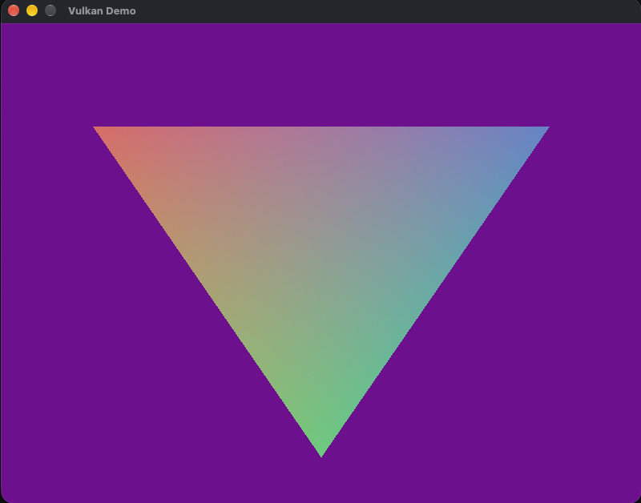

# Vulkan Rendering Demo

This project is a small Vulkan + GLFW demo that renders a colorful animated shape on screen and supports simple keyboard interaction. It is built as a lightweight example of the Vulkan rendering pipeline: instance setup, surface creation, swapchain, render pass, shader pipeline, command recording, and frame presentation.

## Included features

- Vulkan instance and validation layer setup
- GLFW window and Vulkan surface creation
- Swapchain and framebuffer setup
- Vertex + fragment shader pipeline
- Animated colored triangle-based object
- Keyboard interaction for movement and rotation

## Controls

- `A` / `D`: rotate object
- `W` / `S`: move object vertically
- `Q` / `E`: move object horizontally
- `R`: reset the object position and rotation

## Requirements

On macOS, install the dependencies needed for the Vulkan loader and MoltenVK runtime:

```bash
brew install glfw molten-vk vulkan-headers vulkan-loader vulkan-validationlayers
```

## Build

From this folder:

```bash
./build.sh
```

This creates a local `build/` folder and compiles the project with CMake.

## Run

```bash
./run.sh
```

The launch script sets the Vulkan environment variables needed for MoltenVK on macOS:

- `VK_ICD_FILENAMES`: points to the MoltenVK ICD
- `VK_LAYER_PATH`: loads the validation layer from the Vulkan installation

The result looks like this:



## More details

- Vulkan tutorial: https://vulkan-tutorial.com/
- GLFW docs: https://www.glfw.org/docs/latest/
- MoltenVK: https://github.com/KhronosGroup/MoltenVK
- Vulkan SDK / validation layer info: https://vulkan.lunarg.com/

## Original code reference

- https://vulkan-tutorial.com/Drawing_a_triangle/Setup/Base_code


[def]: !pic